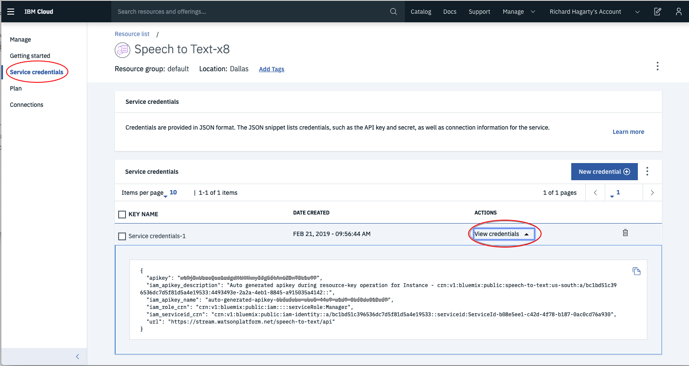
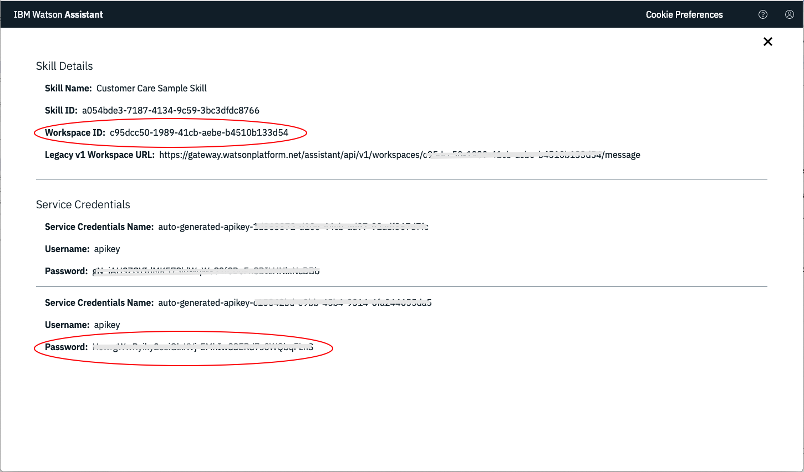
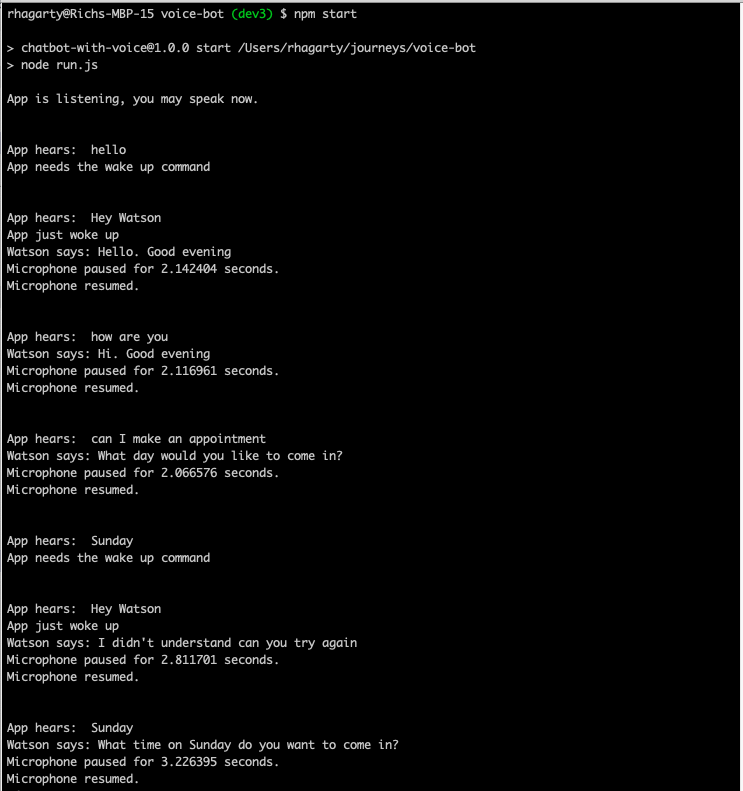

## Introduction

Personal assistant devices are one of the main use cases for Speech to Text technology for main stream users. "Wake words" engage devices to process what they hear, like "Hey Google" or "Alexa", often sending it to the cloud if a connection has been established. Watson Speech to Text can be used somewhat similarly, depending on how you write your client application.

While the libraries and methods might differ for your target platform or programming language, the steps in the tutorial below should help you understand how to create an application that's always listening, but only process after a "wake word" has been triggered.

# Learning objectives

In this tutorial you will learn how to create a **chatbot** in Node.JS that will only engage with the user after a "wake word" is heard. It will utilize several Watson services to handle the verbal dialog between the user and the chatbot.

# Prerequisites

* An [IBM Cloud](https://www.ibm.com/cloud/) account
* A [Watson Speech-to-Text](https://cloud.ibm.com/catalog/services/speech-to-text) service
* A [Watson Text-to-Speech](https://cloud.ibm.com/catalog/services/text-to-speech) service
* A [Watson Assistant](https://cloud.ibm.com/catalog/services/watson-assistant) service
* Basic understanding of [Node.JS](https://nodejs.org/en/) and [NPM](https://www.npmjs.com/)

# Estimated time

Completing this tutorial should take about 30 minutes, assuming you have an IBM Cloud account and an NPM environment setup on your local computer (Mac XOS or Linux).

You will need to create several assets to complete this tutorial - so it would be a good idea to start by creating a fresh local subdirectory to place them all.

# Step 1 - Create Watson Services

From the [IBM Cloud](https://cloud.ibm.com/) dashboard, click the `Create Resource` button to create the "Lite" versions of each service.

## Configure credentials

Cut and paste the following contents into a local file and name it `.env`.

```script
# Watson Assistant
# CONVERSATION_URL=<add_assistant_url>
CONVERSATION_WORKSPACE_ID=<add_assistant_workspace_id>
CONVERSATION_USERNAME=apikey
CONVERSATION_PASSWORD=<add_assistant_iam_apikey>

# Watson Speech to Text
SPEECH_TO_TEXT_URL=<add_speech_to_text_url>
SPEECH_TO_TEXT_USERNAME=apikey
SPEECH_TO_TEXT_PASSWORD=<add_speech_to_text_iam_apikey>

# Watson Text to Speech
TEXT_TO_SPEECH_URL=<add_text_to_speech_url>
TEXT_TO_SPEECH_USERNAME=apikey
TEXT_TO_SPEECH_PASSWORD=<add_text_to_speech_iam_apikey>
```

Replace the `<***>` tags with the actual values created for your services. 

> NOTE: do not change any of the key names, or the value `apikey` for any of the `**_USERNAME` keys.

Credentials can be found by clicking the `Service Credentials` tab, then the `View Credentials` option from the panel of your created Watson service, as shown below:



An additional `WORKSPACE_ID` value is required to access the Watson Assistant service. To get this value, select the `Manage` tab, then the `Launch tool` button from the panel of your Watson Assistance service. From the service instance panel, select the `Skills` tab to display the skills that exist for your service. For this tutorial, we will be using the `Custom Skill Sample Skill` that comes with the service:


Click the option button (highlighted in the image above) to view all of your skill details and service credentials:



# Step 2 - Create your run-time environment

Now we need to download the NPM packages to run our application. Here is a sample `package.json` file that you can place in your local directory.

```json
{
  "name": "chatbot-with-voice-activation-wake-word",
  "version": "1.0.0",
  "description": "Converse with achatbot.",
  "main": "run.js",
  "scripts": {
    "start": "node run.js"
  },
  "dependencies": {
    "dotenv": "^6.0.0",
    "ibm-watson": "^4.0.1",
    "jsonfile": "^4.0.0",
    "mic": "^2.1.1",
    "node-ffprobe": "^1.2.2",
    "play-sound": "^1.1.1",
    "prompt": "^1.0.0"
  }
}
```

Once created, you can simply run the install command to download the requred packages:

```bash
npm install
```

## Install audio-related dependencies

You may need to install a few audio related dependencies if they don't alreay exist on your system.

### On OSX

Use `brew` to install:

* mplayer
* sox
* ffmpeg

```bash
brew install sox mplayer ffmpeg
```

### On Ubuntu

Use `apt-get` to install:

* ffmpeg

```bash
sudo apt-get install ffmpeg
```

# Step 3 - Load the chatbot code

The following code snippet is a simple Node.JS app that will utilize the Watson services you just created.

The code performs the following primary functions:

* Create and initialize instances of the Watson services
* Create and setup the microphone object
* Converts audio from the microphone into text
* Converts text into audio which is then played back through the speaker
* Conducts a dialog by responding to questions from the user
* Keeps a timer to determine if the chatbot is awake or asleep

Cut and paste the following code into a local file and name it `run.js`:

```javascript
require('dotenv').config({ silent: true });

const AssistantV1 = require('ibm-watson/assistant/v1');
const TextToSpeechV1 = require('ibm-watson/text-to-speech/v1');
const SpeechToTextV1 = require('ibm-watson/speech-to-text/v1');
const fs = require('fs');
const mic = require('mic');
const speaker = require('play-sound')(opts = {});
const ffprobe = require('node-ffprobe');
var context = {};
var debug = false;
var botIsActive = false;
var startTime = new Date();

const wakeWord = "hey watson";      // if asleep, phrases that will wake us up

const SLEEP_TIME = 10 * 1000;       // number of secs to wait before falling asleep

/**
 * Configuration and setup
 */

/* Create Watson Services. */
const conversation = new AssistantV1({
  version: '2019-02-28'
});

const speechToText = new SpeechToTextV1({
});

const textToSpeech = new TextToSpeechV1({
});

/* Create and configure the microphone */
const micParams = {
  rate: 44100,
  channels: 2,
  debug: false,
  exitOnSilence: 6
};
const microphone = mic(micParams);
const micInputStream = microphone.getAudioStream();

let pauseDuration = 0;
micInputStream.on('pauseComplete', ()=> {
  console.log('Microphone paused for', pauseDuration, 'seconds.');
  // Stop listening when Watson is talking.
  setTimeout(function() {
    microphone.resume();
      console.log('Microphone resumed.');
  }, Math.round(pauseDuration * 1000));
});

/**
 * Functions and main app
 */

/* Convert speech to text. */
const textStream = micInputStream.pipe(
  speechToText.recognizeUsingWebSocket({
    content_type: 'audio/l16; rate=44100; channels=2',
    interim_results: true,
    inactivity_timeout: -1
  })).setEncoding('utf8');

/* Convert text to speech. */
const speakResponse = (text) => {
  var params = {
    text: text,
    accept: 'audio/wav',
    voice: 'en-US_AllisonVoice'
    // voices to choose from:
    // en-US_AllisonVoice
    // en-US_LisaVoice
    // en-US_MichaelVoice
  };

  var writeStream = fs.createWriteStream('output.wav');
  textToSpeech.synthesize(params)
  .then(audio => {
    // write the audio version of the text to the wav file
    audio.pipe(writeStream);
  })
  .catch(err => {
    console.log('error:', err);
  });

  writeStream.on('finish', function() {
    // determine length of response to user
    ffprobe('output.wav', function(err, probeData) {
      if (probeData) {
        pauseDuration = probeData.format.duration;
        // pause microphone until response is delivered to user
        microphone.pause();
        // play message to user
        speaker.play('output.wav');
        // restart timer
        startTime = new Date();
      }
    });
  });
  writeStream.on('error', function(err) {
    console.log('Text-to-speech streaming error: ' + err);
  });
};

/* Log Watson Assistant context values, so we can follow along with its logic. */
function printContext(header) {
  if (debug) {
    console.log(header);

    if (context.system) {
      if (context.system.dialog_stack) {
        const util = require('util');
        console.log("     dialog_stack: ['" +
                    util.inspect(context.system.dialog_stack, false, null) + "']");
      }
    }
  }
}

/* Log significant responses from Watson to the console. */
function watsonSays(response) {
  if (typeof(response) !== 'undefined') {
    console.log('Watson says:', response);
  }
}

/* Determine if we are ready to talk, or need a wake up command */
function isActive(text) {
  var elapsedTime = new Date() - startTime;

  if (elapsedTime > SLEEP_TIME) {
    // go to sleep
    startTime = new Date();
    botIsActive = false;
  }

  if (botIsActive) {
    // in active conversation, so stay awake
    startTime = new Date();
    return true;
  } else {
    // we are asleep - did we get a wake up call?
    if (text.toLowerCase().indexOf(wakeWord) > -1) {
      // time to wake up
      console.log("App just woke up");
      botIsActive = true;
    } else {
      // false alarm, go back to sleep
      console.log("App needs the wake up command");
    }
    return botIsActive;
  }
}

/* Keep conversation with user alive until it breaks */
function performConversation() {
  console.log('App is listening, you may speak now.');

  textStream.on('data', (user_speech_text) => {
    userSpeechText = user_speech_text.toLowerCase();
    console.log('\n\nApp hears: ', user_speech_text);
    if (isActive(user_speech_text)) {
      conversation.message({
        workspace_id: process.env.CONVERSATION_WORKSPACE_ID,
        input: {'text': user_speech_text},
        context: context
      }, (err, response) => {
        context = response.context;

        watson_response =  response.output.text[0];
        if (watson_response) {
          speakResponse(watson_response);
        }
        watsonSays(watson_response);
      });
    }
  });
}

/* Start the app */
microphone.start();
performConversation();

```

# Step 4 - Run the application

To run the application, simply:

```bash
npm start
```

Some important notes regarding the execution of the chatbot:

* The app starts in sleep mode and will only reply when it hears "Hey Watson!".
* The app will return to sleep mode if it doesn't hear anything for 10 seconds (this value can be changed in the app).
* Once engaged, the app will respond in accordance with the `Customer Care Sample Skill` dialog defined in the Watson Assistant service. You can explore the dialog from within the service tooling for help determining phrases it will respond to.
* Whenever the chatbot talks, it pauses the microphone for the duration of the phrase so that it doesn't inadvertently hear itself and get confused.
* Audio from the app is streamed to a local file named `output.wav`, which is then played out through the speaker.
* The app will generate console output that should help you follow along and debug any issues you may run into.

Here is some example output from the chatbot:



> Note: As you can see, the dialog is less than optimal. When the app goes back to sleep, it should clear the dialog and start fresh. This could be fixed by modifying the smaple dialog provided in Watson Assistant, but dialog customization is beyond the scope of this tutorial.

# Troubleshooting

## If running on Mac OSX, microphone doesn't appear to be picking up any sound

Ensure that the basic microphone functionality is working:

```bash
sox -d test.wav        // speak into mic, then ctrl-c to exit
sox test.wav -d        // playback
```

# Summary

This tutorial shows how you can use a wake word to initiate dialog with a chatbot built on IBM Watson services.

If you're looking for a similar solution that works in a browser, take a look at the article ["Capturing Audio in the Browser for "Wake Words"](https://medium.com/@MissAmaraKay/capturing-audio-in-the-browser-for-wake-words-cc4972263773).

Looking for other solutions for streaming? Check out the [Node.JS SDK example](https://github.com/watson-developer-cloud/node-sdk/blob/master/examples/speech_to_text.v1.js).
